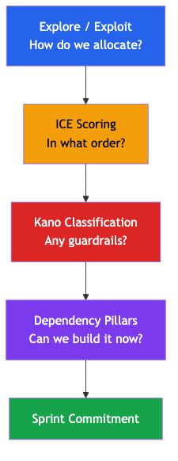
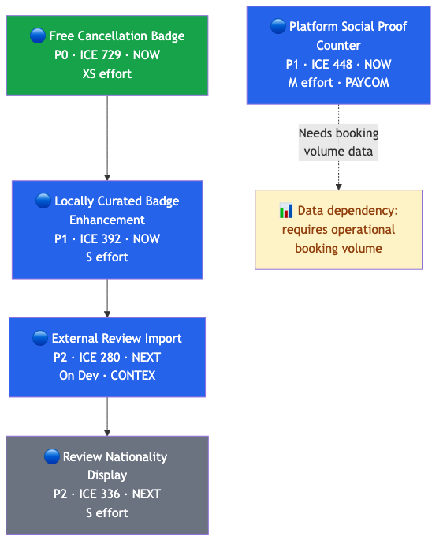
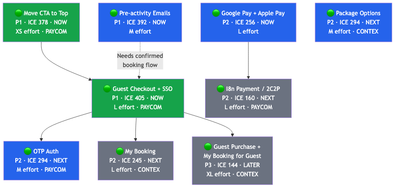
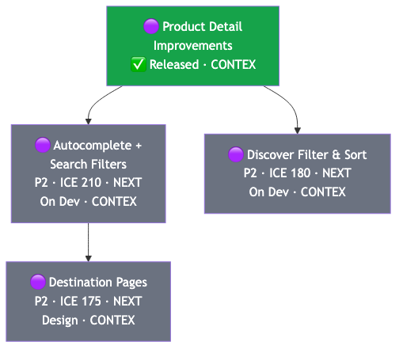
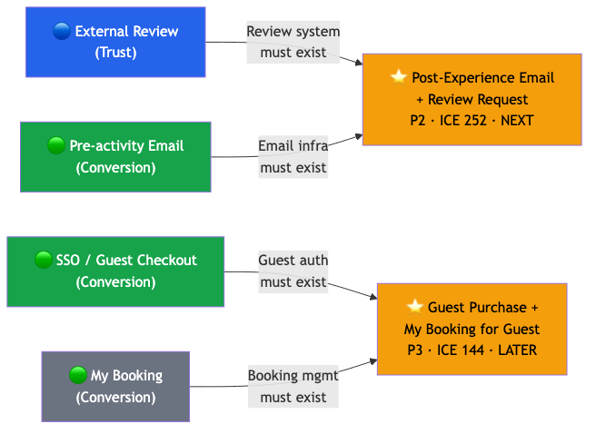

# 04 — Dependency Graph & Sequencing

## Why Dependency Pillars: The Fourth Layer

The first three layers (Explore/Exploit → ICE → Kano) answer **what** to build and in **what order**. But they don't answer: **can we build it now?**

A P1 item might depend on a P2 item that hasn't shipped yet. ICE says "build the P1 first," but the dependency says "you can't." Without a sequencing layer, the team picks the highest-scoring item, starts building, and discovers mid-sprint it's blocked.

| Layer | Question | Without It |
|---|---|---|
| **Explore/Exploit** | How to allocate sprints? | Team stagnates or scatters |
| **ICE** | What order to build? | Everything feels equally important |
| **Kano** | Any user-expectation overrides? | Basic features get deprioritized |
| **Dependency Pillars** | Can we build it now? | Team starts items blocked by unshipped dependencies |

> **Example**: Review Nationality Display (P2, ICE=336) scores higher than External Review (P2, ICE=280). ICE says build nationality display first. But nationality display *depends on* review data — External Review must ship first. The dependency layer catches this.

---

## Three Dependency Pillars

Every initiative in the backlog serves one of three strategic pillars. Within each pillar, features depend on each other — building the wrong thing first wastes effort or creates dead-end features.

| Pillar           | Core Question                                                 | NSM Connection                                         |
| ---------------- | ------------------------------------------------------------- | ------------------------------------------------------ |
| **🔵 Trust**      | "Will the visitor believe this is safe and legitimate?"       | No trust → no checkout → no bookings                   |
| **🟢 Conversion** | "Can the visitor complete the booking with minimal friction?" | Friction → abandonment → lost bookings                 |
| **🟣 Discovery**  | "Can the visitor find the right experience?"                  | No discovery → no listing views → no checkout attempts |

> **Sequencing Rule**: Trust → Conversion → Discovery. A visitor who finds the perfect listing but doesn't trust the platform won't book. A visitor who trusts the platform but can't checkout as a guest won't book. Fix Trust first, then Conversion, then Discovery.

---

## Trust Chain

**Chain Logic:**
- Free Cancel Badge (T1) is a standalone badge — no dependencies, maximum impact per effort
- Locally Curated enhancement (T2) refines the existing badge — builds on T1's visual language
- External Review (T3) imports third-party reviews — needs review data pipeline, which T2's trust context supports
- Social Proof Counter (T4) is independent but requires booking volume data to be meaningful — data dependency, not feature dependency
- Review Nationality Display (T5) depends on External Review data (T3) — can't display nationality without review records

---

## Conversion Chain

**Chain Logic:**
- CTA Move (C1) is standalone — quick win, no architecture changes
- SSO / Guest Checkout (C2) is the critical path — it unblocks OTP Auth, My Booking, and Guest Purchase
- OTP Auth (C3) can only be built after SSO architecture is in place (shared auth layer)
- Google/Apple Pay (C5) is independent but 2C2P (C6) builds on the same payment gateway architecture
- Pre-activity Emails (C4) require a confirmed booking to trigger — soft dependency on checkout flow
- Package Options (C7) is independent — can be built by CONTEX in parallel
- My Booking (C8) and Guest Purchase (C9) both depend on auth/SSO (C2)

---

## Discovery Chain

**Chain Logic:**
- Product Detail Improvements (D0) is the foundation — already released, listing pages are baseline
- Autocomplete + Filters (D1) and Filter & Sort (D2) can be built in parallel on top of D0
- Destination Pages (D3) need search/filter infrastructure to link to filtered listing views

---

## Cross-Chain Dependencies

Three initiatives depend on features from multiple chains. These are **junction points** that cannot start until their dependencies across chains are met.

| Junction Initiative                    | Depends On                                                      | Earliest Start                                    |
| -------------------------------------- | --------------------------------------------------------------- | ------------------------------------------------- |
| Post-Experience Email + Review Request | External Review (Trust) + Pre-activity Email infra (Conversion) | Sprint N+2 (after both chains reach those points) |
| Guest Purchase + My Booking for Guest  | SSO (Conversion) + My Booking (Conversion)                      | Sprint N+3 (after both are shipped)               |

---

## Parallel Sprint Tracks

PAYCOM and CONTEX squads can work their respective chains in parallel. Trust and Conversion are PAYCOM-heavy; Discovery is CONTEX-heavy.

| Sprint  | PAYCOM (Trust + Conversion)                                 | CONTEX (Discovery + Ops)                                                          | Cross-Chain             |
| ------- | ----------------------------------------------------------- | --------------------------------------------------------------------------------- | ----------------------- |
| **N**   | 🔵 Free Cancel Badge + 🟢 CTA Move + 🟢 SSO (continue testing) | 🟣 Autocomplete + Filters (continue dev) + 🟣 Discover Filter & Sort (continue dev) | —                       |
| **N+1** | 🔵 Locally Curated Enhancement + 🟢 Pre-activity Emails       | 🔵 External Review (continue dev) + 🟢 Package Options                              | —                       |
| **N+2** | 🔵 Social Proof Counter + 🟢 OTP Auth                         | 🟣 Destination Pages (design → dev) + 🟢 My Booking                                 | —                       |
| **N+3** | 🟢 Google/Apple Pay + 🔵 Review Nationality                   | 🟣 Destination Pages                                                                | ⭐ Post-Experience Email |
| **N+4** | 🟢 2C2P Payment                                              | —                                                                                   | ⭐ Guest Purchase Flow   |

> **Note**: Sprint assignments are illustrative. Actual sprint loading depends on team capacity and velocity. The key constraint is the dependency ordering within each chain — items cannot be reordered without breaking the dependency logic.

---

## Status Legend

| Color         | Meaning                                               |
| ------------- | ----------------------------------------------------- |
| 🟩 Green fill  | P0–P1, NOW horizon — immediate action                 |
| 🟦 Blue fill   | P1–P2, NOW–NEXT — scheduled or in progress            |
| ⬜ Grey fill   | P2–P3, NEXT–LATER — backlogged                        |
| 🟨 Yellow fill | Cross-chain junction — blocked until dependencies met |
| ✅             | Already released                                      |
| Dashed arrow  | Soft dependency (data or infra, not feature)          |
| Solid arrow   | Hard dependency (feature must exist first)            |

---

## When to Generate & Review

The dependency graph is **not a one-time artifact**. It must be reviewed at key moments:

| Trigger | Action | Who |
|---|---|---|
| **New initiative enters backlog** | Assign a Dependency Pillar (Trust / Conversion / Discovery) and identify any blockers | PM |
| **Sprint planning** | Check that all items committed for the sprint have their dependencies met or in-flight | PM + Engineering PIC |
| **Initiative ships** | Mark as Released. Check if any blocked items are now unblocked — promote them for next sprint | PM |
| **Quarterly review** | Regenerate the full dependency graph from the current backlog. Archive the old version. | PM |
| **Initiative invalidated** | Remove from graph and all downstream references. Check if removal unblocks or orphans other items. | PM |

> **Rule of thumb**: If you're unsure whether to update the graph, check the sprint tracks table above. If the current sprint doesn't match the table, the graph is stale.

---

## Where to Track: Backlog Tracker Columns

Dependencies should be tracked **in the Backlog Tracker** (Page 08), not in a separate document. Add the following columns to the tracker sheet:

| Column | Type | Values | Purpose |
|---|---|---|---|
| **Pillar** | Dropdown | `Trust` / `Conversion` / `Discovery` / `—` | Assigns the initiative to a dependency chain. Use `—` for infra or ops items that don't map to a user-facing pillar. |
| **Blocked By** | Text | Initiative name or `—` | Names the specific initiative that must ship first. If none, use `—`. |
| **Blocks** | Text | Initiative name(s) or `—` | Names which downstream initiative(s) this item unblocks when shipped. |

### Example Tracker Rows

| Initiative | Pillar | Blocked By | Blocks |
|---|---|---|---|
| Free Cancellation Badge | Trust | — | Locally Curated Enhancement |
| External Review Import | Trust | Locally Curated Enhancement | Review Nationality Display |
| Guest Checkout + SSO | Conversion | — | OTP Auth, My Booking, Guest Purchase |
| OTP Auth | Conversion | Guest Checkout + SSO | — |
| Autocomplete + Search Filters | Discovery | — | Destination Pages |

### Why Track in the Backlog Tracker

- **Single source of truth** — the team already checks the tracker for ICE, Kano, Horizon, and Explore/Exploit. Adding Pillar + Blocked By keeps all decision dimensions in one view.
- **Filterable** — PM can filter by `Pillar = Trust` to see the full Trust chain, or filter `Blocked By ≠ —` to see all blocked items.
- **Sprint-ready** — during sprint planning, filter `Blocked By = —` AND `Status ≠ Released` to see all items that are ready to pick up.
